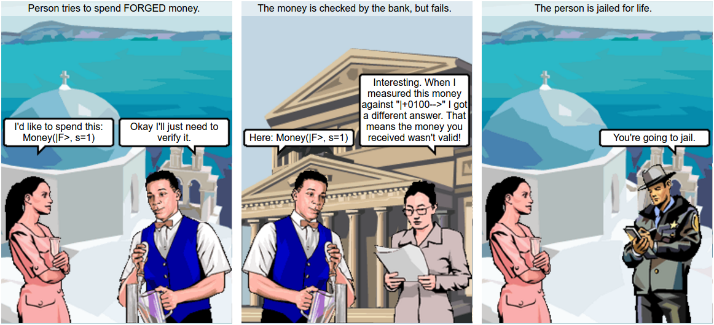

Due to the release of (yet another) Python framework for quantum simulation
[ProjectQ](https://github.com/silky/ProjectQ), I was inspired to revisit the
paper [An adaptive attack on Wiesner's quantum
money](https://arxiv.org/abs/1404.1507) from a few years back.

This post will form the first post of a three-part series on the paper, and
the background necessary to understand the part of it I'll cover.  We'll
learn about:

1. [Wiesner's scheme for quantum money, and why it was considered secure](#)
   (this post),
2. An attack on Wiesner's money scheme that shows it is not secure (with an
   aside into quantum bomb testing!),
3. and, A modification of Wiesner's scheme that resists this attack.

# Wiesner's scheme

Wiesner's Quantum Money scheme is one of the earliest ideas in quantum
computing. The fundamental idea is that (unknown) quantum states [cannot
be copied arbitrarily](https://en.wikipedia.org/wiki/No-cloning_theorem) and
hence make an "unforgable" form of money: it shouldn't be possible to
duplicate a "quantum" bill.

Money, in Wiesner's scheme, is created by the bank. The bank holds a serial
number and a secret "key" that the bank uses to verify each note that it hands
out. When given a note, the bank can determine if it is valid by referring
back to this secret key.

The important steps are:

1. **Money generation**: Done by the bank here; the bank creates money by
   randomly picking a quantum state, called it $|\$\rangle$, and handing that
   state to the customer, and recording the state it generated by matching it
   to the serial number of the note.

2. **Money verification**: When someone wishes to spend money, the bank
   verifies it.

Let's take a look in detail. We'll first need to recall some standard quantum
states:

$$ \begin{aligned}
    |0\rangle &= \left( \begin{array}{c}
        1 \\ 0
    \end{array} \right), \\
    |1\rangle &= \left( \begin{array}{c}
        0 \\ 1
    \end{array} \right), \\
    |+\rangle &= \frac{1}{\sqrt{2}} \left( |0\rangle + |1\rangle \right), \\
    |-\rangle &= \frac{1}{\sqrt{2}} \left( |0\rangle - |1\rangle \right).
\end{aligned} $$

The first two states, $\{|0\rangle, |1\rangle\}$ form a _basis_[^1] -- the
_computational_ basis -- for a single qubit, and the second two, $\{|+\rangle,
|-\rangle\}$ form a different, orthogonal, basis -- the _Hadamard_ basis. 

[^1]: A one-qubit _basis_ is a set of states such that any state involving one
        qubit can be written as a linear combination of either of the elements in the
        basis.

The crucial idea to understanding the scheme is that in quantum mechanics,
_measurement_ can irreversibly destroy a given quantum state, changing it
to be a completely different one.

## Measurement

To _measure_ a given state in quantum mechanics is to first fix a set of
potential measurement outcomes, and then "look" at the given state, and see
which one of these outcomes the state when in. Let's see an example.

Suppose we have a single qubit in some unknown state:

$$ \begin{aligned}
    |\psi\rangle &= \alpha |0\rangle + \beta |1\rangle
\end{aligned} $$

We can _measure_ the qubit in either the _computational_ basis or the
_Hadamard_ basis. 

**Computational basis**.
Noting that it is already express in *terms* of the computationl basis, if we
measure it in the computational basis, the [Born
rule](https://en.wikipedia.org/wiki/Born_rule) for measurement says that we
will get the state $|0\rangle$ with probabily $|\alpha|^2$ and the state
$|1\rangle$ with probabily $|\beta|^2$.

**Hadamard basis**: Note that $|0\rangle = \frac{1}{\sqrt{2}} \left( |+\rangle +
|-\rangle \right)$ and $|1\rangle = \frac{1}{\sqrt{2}} \left(|+\rangle -
|-\rangle \right)$ so we can re-write $|\psi\rangle$ as 
$$ \begin{aligned}
    |\psi\rangle &= \frac{\alpha + \beta}{\sqrt{2}} |+\rangle + 
                    \frac{\alpha - \beta}{\sqrt{2}} |-\rangle
\end{aligned} $$
and so, again by the Born rule, we would achieve outcome $|+\rangle$ with
probability $\left|\frac{\alpha + \beta}{\sqrt{2}}\right|^2$ and $|-\rangle$
with probability $\left|\frac{\alpha - \beta}{\sqrt{2}}\right|^2$.

The point to note here is that the final state is *different* depending on
which basis we measured it in.  Wiesner used this fact to build a (hopefully)
unforgable form of money.

## Wiesner's quantum money

**Money generation**: To withdraw money from a bank in Wiesner's scheme, the
bank performs the following steps:

1. Pick a serial number, $s$,
1. Pick $n$ states at random from $|0\rangle, |1\rangle, |+\rangle,
   |-\rangle$, call this the _key_ and save these choices in a database linked
   to the serial number.
1. Build a quantum state from these basis elements, and call the combined
   state $|\$\rangle$.
1. Yield a bank note to the customer with the given serial number $s$ and
   the embedded quantum state $|\$\rangle$.

**Money verification**: To verify a given piece of money, the bank proceeds
as follows:

1. Look up the key for the provided serial number $s$,
1. Measure each qubit in the basis that the we know it was created from.
1. If the money state hasn't changed, then we will measure it
   to be in the same state that we created it, and we can say
   that it is valid.
    

    
    

1. If the money state _has_ changed, then there is a chance that the
   measurement results will disagree, and we can be sure that it has
   been tampered with.
    

    
    

1. In the case that validation succeeds, the money state is returned to the
   person requesting validation, and in the case that the validation fails,
   the money is destroyed.

Having the _same_ money state returned, instead of a new one each time
validation succeeds, is critical to the success of the forging approach of
[arXiv:1404.1507](https://arxiv.org/pdf/1404.1507v4.pdf).

## Standard analysis of Wiesner's scheme

Let's look at an example. Suppose we have withdrawn some money from the bank,
and the state we've been given (but can't see) is

$$ \begin{aligned}
    |\$\rangle &= |+100--\rangle.
\end{aligned} $$

There are six qubits, and _we_ can see the bases that each has been prepared
in, but if we're simply the customer we don't know this information.

Our goal is to create a state $|F\rangle$ that the bank will *also* verify as
valid.

Noting that if we measure either $|+\rangle$ or $|-\rangle$ in the
computational basis, we'll get $|0\rangle$ with 50\% probability or
$|1\rangle$ with 50\% probability, one approach is simply to build $|F\rangle$
by the following technique:

1. Measure each qubit indepnedently in the _computational basis_, and obtain
   some measurement outcome $x \in \{0, 1\}$.
2. In this way, build up $|F\rangle$ from states $|x\rangle$.

In our example, we can see that this will work 50\% of the time for the first
qubit of $|\$\rangle$, 100\% of the time for the 2nd, 3rd and 4th qubits, and
again 50\% of the time for the last two qubits. So for this state, this
approach will succeed with probability $\left( \frac{1}{2} \right)^3 =
\frac{1}{8}$. Pretty bad odds.

In an earlier paper, [Molina Vidick and
Watrous](https://arxiv.org/pdf/1202.4010.pdf) show that in a model where the
attacker *doesn't* interact with the bank after receiving the note, the best
attack that one can mount results in a success probability of
$\left(\frac{3}{4}\right)^n$, where $n$ is the number of qubits in the money
state. This is better than my approach here, but if we set $n$ to be of modest
size, say $n = 10$, then this approach will succeed _at most_ 5 times out of
100; still not particularly good. If we had 100 twenty dollar notes, we could
attempt to forge them, and we'd end up with a total of $2 \times 5 \times 20 =
\$200$ instead of the original $\$2,000$ we started with.

# Summary

We've seen that Wiesner's original scheme for quantum money doesn't appear to
be forgable with our first ideas. In the next post we'll learn about a very
cool technique in quantum mechanics, the [Elitzur-Vaidman bomb
tester](https://en.wikipedia.org/wiki/Elitzur%E2%80%93Vaidman_bomb_tester),
and then we'll see how it can be used to beat Wiesner's scheme!

