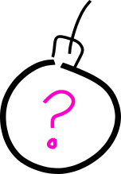

This post is the second of a three-part series on the paper [An adaptive
attack on Wiesner's quantum money](https://arxiv.org/abs/1404.1507). The other
parts are:

1. [Wiesner's scheme for quantum money, and why it was considered
   secure](/posts/2017-01-06-forging-quantum-money-part-1.html),
2. [An attack on Wiesner's money scheme that shows it is not secure (with an
   aside into quantum bomb testing!)](#) (this post),
3. and, A modification of Wiesner's scheme that resists this attack.

Now that we're familiar with the Wiesner's original scheme for quantum money,
we can take a look at the "bomb testing" attack presented in the paper.  The
paper actually introduce two attacks, one more general than the other, but
I'll focus on the less general one; the _bomb testing_ attack, because it's
more fun.

But before we see how it's applied, let's take a look at [the bomb testing
idea](https://en.wikipedia.org/wiki/Elitzur%E2%80%93Vaidman_bomb_tester),
because it's very cool.

## Bomb testing

Suppose I give you 10 bombs, some of which might be duds, and some which are
live. 
<table width='100%'>
<tr> <td width='10%' style='text-align: center'>

</td> <td width='10%' style='text-align: center'>

</td> <td width='10%' style='text-align: center'>

</td> <td width='10%' style='text-align: center'>

</td> <td width='10%' style='text-align: center'>

</td> <td width='10%' style='text-align: center'>

</td> <td width='10%' style='text-align: center'>

</td> <td width='10%' style='text-align: center'>

</td> <td width='10%' style='text-align: center'>

</td> <td width='10%' style='text-align: center'>

</td> </tr>
</table>

The task is:
*Can you determine a test that separates the live bombs from the dud ones?*

Classically, one approach would be to simply attempt to detonate each bomb. If
the bomb goes off, then it was a live bomb, and if it doesn't, it wasn't!
Simple enough, but it leaves us with no good bombs to actually use.

Quantumly, it turns out there _is_ something we can do that actually lets us
know if the bomb is live or not, _and_ keeps the bomb un-detonated!
 

## Elitzur-Vaidman bomb tester

In this model, we suppose that our bombs are configured like so:

<table width='100%'>
<tr> <td width='50%' style='text-align: center'>

</td> <td width='50%' style='text-align: center'>

</td> </tr>
<tr> <td>
**Live bomb**: Has a single-photon detector. If a photon hits, it, it
explodes.
</td> <td>
**Dud bomb**: Does _not_ have a photon detector. The photon will pass
unchanged through this bomb, and the bomb itself does not explode.
</td> </tr>
</table>

We then recall the operation of a Mach-Zender Interferometer.

<svg id="table" width="400" height="400">
<path d="M 100,300 H 300 V 100 H 100 V 300" stroke="#ff80ff" fill="none" />
<image xlink:href="../images/half-mirror.png" width="60" height="60" x="80" y="270">
</image>
<!-- single-photon source -->
<image xlink:href="../images/photon-source.png" width="30" height="60" y="270">
</image>
<!-- 
<path d="M -15,15 C -5 -25, 5 -25, 15 15" stroke="blue" stroke-width="2" fill="white">
-->
<path d="M 20,300 H 75 V 75 H 400" stroke="none" fill="none" id="upperPath"/>
<image xlink:href="../images/wave-up.png" width="50" height="30">
    <animateMotion dur="5s" repeatCount="indefinite">
        <mpath xlink:href="#upperPath"/>
    </animateMotion>
</image>
<!-- -->
<path d="M 25,298 H 275 V 98 H 400" stroke="none" fill="none" id="lowerPath"/>
<image xlink:href="../images/wave-down.png" width="50" height="30">
    <animateMotion dur="5s" repeatCount="indefinite">
        <mpath xlink:href="#lowerPath"/>
    </animateMotion>
</image>
<!--
https://developer.mozilla.org/en/docs/Web/SVG/Tutorial/Paths
<circle r="15" fill='pink'>
<animateMotion dur="5s" repeatCount="indefinite">
<mpath xlink:href="#theMotionPath"/>
</animateMotion>
-->
</circle>
</svg>

<!--
https://arxiv.org/pdf/quant-ph/9806048.pdf
https://arxiv.org/pdf/1607.03935.pdf
https://en.wikipedia.org/wiki/Linear_optical_quantum_computing
https://pdfs.semanticscholar.org/7b4c/11cd151d2b1d2391889eef16eed3a65e8465.pdf
http://www.upscale.utoronto.ca/PVB/Harrison/MachZehnder/MachZehnder.html
https://arxiv.org/pdf/1404.1507v4.pdf
http://journals.aps.org/prl/abstract/10.1103/PhysRevLett.74.4763
https://en.wikipedia.org/wiki/Elitzur%E2%80%93Vaidman_bomb_tester
http://codepen.io/Xanmia/pen/DoljI
http://www.rle.mit.edu/qem/documents/kwiat-prl-74-4763.pdf
    -->
